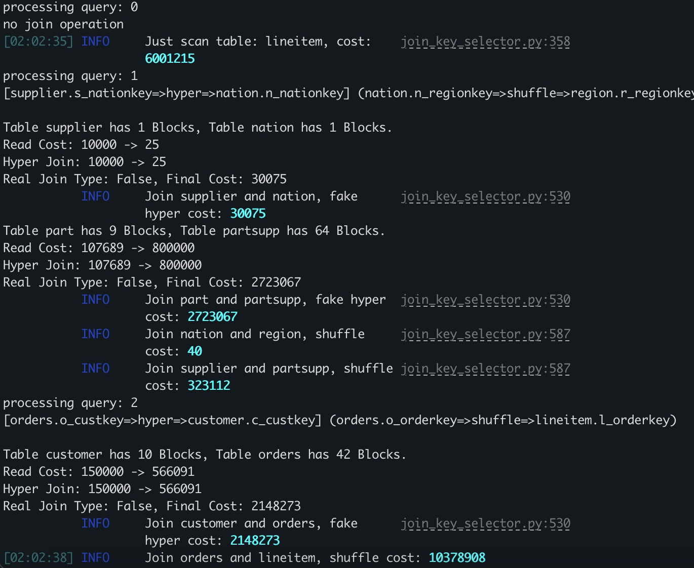

# Beyond Shuffling: PAC-Tree for Efficient Distributed Joins via Hierarchical Data Placement

## Overview

This repository contains the implementation and experimental framework for **PAC-Tree**, a novel hierarchical data placement strategy designed to minimize network shuffling overhead in distributed join processing. Our approach fundamentally reimagines how data is partitioned and distributed across computing nodes by leveraging query workload characteristics and join key distributions.


## Repository Structure

```
├── conf/                      # Context args
├── model/                    # Core partitioning algorithms
│   ├── partition_algorithm.py    # Main PAC-Tree implementations
│   ├── partition_tree.py         # Tree data structure primitives
│   ├── partition_node.py         # Node-level operations and metrics
│   ├── join_eval.py              # Join cost evaluation framework
│   └── join_key_selector.py      # Join key analysis and selection
├── db/                       # Database connectivity and data management
│   ├── connector.py              # Multi-database connection handling
│   ├── data_tooler.py            # Data preprocessing and sampling
│   └── query_tooler.py           # Query parsing and workload extraction
├── queryset/                 # Pre-processed benchmark workloads
│   ├── tpch/                     # TPC-H query sets
│   ├── tpcds/                    # TPC-DS query sets
│   └── imdb/                     # IMDB workload 
├── dataset/
│   ├── tpch/                     # TPC-H dataset
│   ├── tpcds/                    # TPC-DS dataset
│   └── imdb/                     # IMDB dataset
├── spark/                    # Apache Spark integration
    ├── data_writer.py            # Distributed data loading
    └── spark_query.py            # Spark SQL query execution
```

## Usage Instructions

### Prerequisites
- Python 3.9+
- Apache Spark 3.x (for distributed experiments)
- PostgreSQL (for data generation and query parse)
- Required packages: `numpy`, `pandas`, `scikit-learn`, `psycopg2`

### Quick Start

1. **Environment Setup**
   ```bash
   conda create -n ai4db python=3.9
   conda activate ai4db
   pip install -r requirements.txt --force-reinstall
   cd docker && docker-compose up -d  # use docker to start PostgreSQL and Spark services (It is recommended to manually install a Spark cluster on multiple real machines.)
   ```

2. **Import necessary Dataset**
   ```txt
   please follow the instructions of db/get_started/db_preparation.md
   ```

3. **Data Generation and Query Preparation**
   ```bash
   python ./db/data_tooler.py --benchmark=tpch --export_metadata --export_csv
   python ./db/query_tooler.py --benchmark=tpch --format --export_mto_paw_queries --export_pac_queries
   # Configure more benchmarks please refer to run.sh
   ```

4. **PAC-Tree Construction**
   ```bash
   python ./model/join_key_selector.py --init=True --benchmark=tpch
   # Configure more benchmarks please refer to run.sh
   ```

5. **Performance Evaluation**
   ```bash
   python ./model/join_key_selector.py --mode=dubug --benchmark=tpch --command=0
   python ./model/join_key_selector.py --mode=dubug --benchmark=tpch --command=1
   # Configure more benchmarks please refer to run.sh
   ```

   Run example:

   

   Output example:
   
   [Standard Result Example](./example/run_example2.json)


## License

This project is licensed under the MIT License - see the [LICENSE](LICENSE) file for details.
